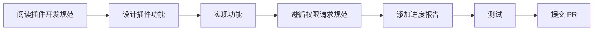
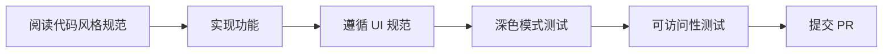

# 开发者指南

欢迎来到 RokunTool 开发者指南!

## 🎯 新手入门

如果您是第一次参与 RokunTool 开发,请按以下顺序阅读:

### 1. 环境准备

- **[环境配置](guides/environment-config.md)** - 🔴 **必读!** 统一的环境配置系统
- **[环境检查](guides/environment-check.md)** - 确保您的开发环境配置正确
- **[GitHub 设置](guides/github-setup.md)** - 配置 Git 和 GitHub

### 2. 了解架构

- **[架构总览](architecture/overview.md)** - 了解 RokunTool 的整体架构
- **[插件系统架构](architecture/plugin-system.md)** - 理解插件系统如何工作
- **[主应用架构](architecture/main-app.md)** - 了解 Electron 应用的结构

### 3. 开发规范

**⚠️ 重要**: 所有开发工作必须遵循以下规范:

- **[插件开发规范](standards/plugin-development.md)** - **必读!** 插件开发的强制性规范
- **[开发规范总览](standards/overview.md)** - 所有规范的快速参考
- **[代码风格规范](standards/coding-style.md)** - TypeScript 和 React 代码风格
- **[UI 组件规范](standards/ui-components.md)** - UI/UX 一致性要求

### 4. API 参考

- **[权限系统 API](api/permissions.md)** - 权限请求和检查 API
- **[事务系统 API](api/transactions.md)** - 事务执行和回滚 API
- **[插件上下文 API](api/plugin-context.md)** - 插件可用的完整 API

## 📋 开发工作流

### 开发插件



**关键检查点**:
- ✅ 使用 `requestFeaturePermissions()` API
- ✅ 权限请求在进度报告之前
- ✅ 提供清晰的功能名称和描述
- ✅ 错误处理和日志记录

### 开发主应用



**关键检查点**:
- ✅ TypeScript 严格模式
- ✅ 明暗主题都测试
- ✅ WCAG AA 可访问性
- ✅ JSDoc 注释

## 🎓 学习路径

### 插件开发者路径

1. **入门** (1-2 天)
   - 阅读 [插件开发规范](standards/plugin-development.md)
   - 阅读 [权限 API](api/permissions.md)
   - 查看示例插件代码

2. **实践** (3-5 天)
   - 创建简单插件
   - 实现权限请求
   - 添加进度报告

3. **进阶** (1-2 周)
   - 学习 [事务 API](api/transactions.md)
   - 实现复杂功能
   - 添加回滚支持

### 主应用开发者路径

1. **入门** (1-2 天)
   - 阅读 [代码风格规范](standards/coding-style.md)
   - 阅读 [UI 设计系统](UI-DESIGN-SYSTEM.md)
   - 了解项目结构

2. **实践** (3-5 天)
   - 修复简单 bug
   - 添加小功能
   - 遵循代码审查反馈

3. **进阶** (1-2 周)
   - 阅读架构文档
   - 实现复杂功能
   - 优化性能

## 🔧 常用工具和命令

### 开发命令

```bash
# 安装依赖
cd rokun-tool && pnpm install

# 启动开发服务器(开发模式,沙箱禁用)
npm run dev

# 启动开发服务器(生产模式,沙箱启用)
npm run dev:prod

# 类型检查
npm run typecheck

# 构建应用
npm run build

# 运行测试
npm test
```

> 💡 **提示**: 详见 [环境配置文档](guides/environment-config.md) 了解开发/生产模式的区别

### 代码检查

```bash
# TypeScript 类型检查
npm run typecheck:node
npm run typecheck:web

# Lint 检查
npm run lint
```

## 📖 推荐阅读顺序

### 第一周

1. Day 1-2: [插件开发规范](standards/plugin-development.md)
2. Day 3-4: [权限 API](api/permissions.md)
3. Day 5: [事务 API](api/transactions.md)

### 第二周

1. Day 1-2: [插件系统架构](architecture/plugin-system.md)
2. Day 3-4: [代码风格规范](standards/coding-style.md)
3. Day 5: [UI 设计系统](UI-DESIGN-SYSTEM.md)

## 🔍 快速参考

### 遇到问题时?

| 问题类型 | 查看文档 |
|---------|---------|
| 如何请求权限? | [权限 API](api/permissions.md) |
| 如何使用事务? | [事务 API](api/transactions.md) |
| 如何创建插件? | [插件开发规范](standards/plugin-development.md) |
| UI 组件如何用? | [UI 设计系统](UI-DESIGN-SYSTEM.md) |
| 代码风格要求? | [代码风格规范](standards/coding-style.md) |

### 决策树

```
我要做什么?
├─ 开发插件?
│  └─> 先读: [插件开发规范](standards/plugin-development.md)
│
├─ 修改主应用?
│  ├─ UI 相关?
│  │  └─> 先读: [UI 设计系统](UI-DESIGN-SYSTEM.md)
│  └─ 后端相关?
│     └─> 先读: [代码风格规范](standards/coding-style.md)
│
└─ 创建提案?
   └─> 先读: [OpenSpec AGENTS.md](../openspec/AGENTS.md)
```

## 💡 最佳实践

### 提交代码前检查清单

- [ ] 遵循了相关的开发规范
- [ ] 代码通过 TypeScript 类型检查
- [ ] UI 组件在明暗主题下都正常显示
- [ ] 添加了必要的错误处理
- [ ] 添加了日志记录
- [ ] 更新了相关文档
- [ ] 编写了清晰的 commit message

### 代码审查要点

- **安全性**: 权限检查是否正确?
- **用户体验**: 进度报告是否清晰?
- **错误处理**: 错误是否被正确捕获和处理?
- **代码质量**: 是否遵循代码风格规范?
- **文档**: 是否更新了相关文档?

## 🆘 获取帮助

- 查看 [FAQ](user/faq.md)
- 提交 [Issue](https://github.com/icbyhero/RokunTool/issues)
- 联系维护者

---

**提示**: 将此页面加入书签,作为开发工作的起点!

**最后更新**: 2026-01-14
